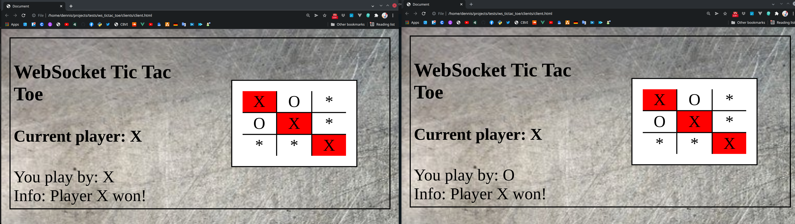
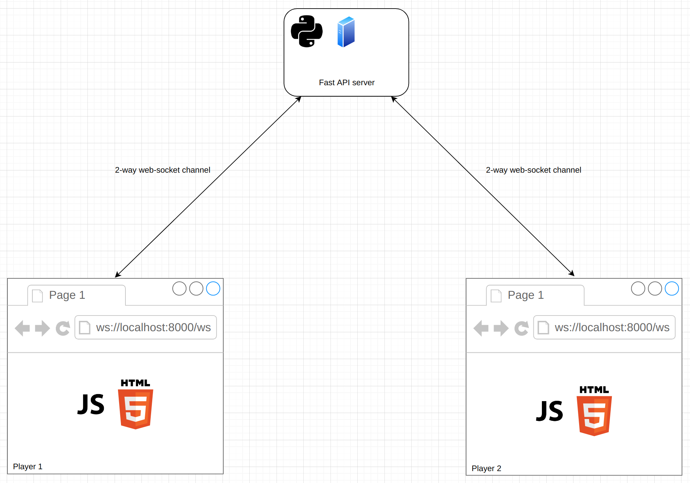

# Web-socket Tic Tac Toe game [Video How to (RUS)](https://youtu.be/mlDanE_-0mY)

## How to install

```bash
pip istall -r requirements.txt
```

## How to run

```bash
cd ./server
uvicorn main:app --reload
```
Open in a browser ./clients/client.html for each player
## How it works

